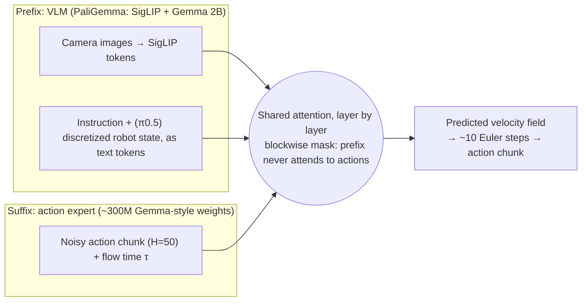

<div align="center">

# Dissecting π

**From zero to hero in vision-language-action models.**

Take a π0.5-style robot foundation model apart, *measure* why every part is there,
and rebuild the whole pipeline (data engine → training → RL post-training) for your own robot.

`status: pre-alpha — Module 1 in progress` · [Roadmap](ROADMAP.md) · [How to contribute a dissection](CONTRIBUTING.md)

</div>

---

## Why this exists

You can already fine-tune π0.5 by following a recipe: download `pi05_base`, point it at a dataset, run `train`.
What the recipe doesn't tell you is **why**:

- Why does π0.5 have a separate *action expert* instead of just predicting action tokens?
- Why predict 50 actions at once, and what breaks if you predict 5?
- Why stop gradients from the action expert into the VLM?
- How many demonstrations do I actually need, and is 50 good ones better than 200 sloppy ones?
- What ratio of my task data to general data should I train on?
- How do I collect high-quality demonstrations without spending every evening teleoperating?
- When imitation plateaus, how do I use RL to push a VLA further?

Without those answers you can follow a recipe, but you can't **adapt** it to a new robot, a new task, or a tight compute budget. Today that knowledge lives in a few papers and a lot of lab folklore.

**Dissecting π turns each of those questions into a small, reproducible experiment with a number at the end.**

> π is our *model organism*. Biology students dissect a frog to learn vertebrate anatomy, not because the frog is special.
> We dissect the π family because it is the most widely used, openly released VLA design, and what you learn transfers to every model built the same way.

## How every module works

Each module is one question, answered the same way:

| Step | What you get |
|---|---|
| **Question** | A plain-language "why" (e.g. *Why an action expert?*) |
| **Mechanism** | The 20–100 lines of code that implement that part, annotated, plus the matching lines in openpi / LeRobot |
| **Hypothesis** | What the π papers claim, and what we expect to see |
| **Experiment** | One config switch, run on a fixed benchmark with fixed seeds |
| **Result** | A table/plot with success rates **and confidence intervals**, including results that contradict the papers |
| **Knob** | "If your robot/task looks like X, set this to Y," which is what lets you customize |

No result is reported without seeds, number of evaluation episodes, and an interval. A 4-point gain from 50 rollouts is usually noise, and Module 0 teaches you why.

## The model under the knife



Every arrow and box in this diagram is a design decision with alternatives. The [roadmap](ROADMAP.md) assigns each one to a module.

## Two tracks, one architecture

| | **nano-π** (learning track) | **π0.5** (reality check) |
|---|---|---|
| Size | ~0.3–0.5B, small VLM backbone + small action expert | ~3–4B (`pi05_base`) |
| Hardware | one 24 GB consumer GPU | rented 48–80 GB GPU, LoRA |
| Purpose | Run *every* ablation cheaply; every π0.5 design choice is a config flag | Replicate the key findings at full scale; map nano-π code to openpi / LeRobot lines |

nano-π is a readable reimplementation, not a new model. It deliberately mirrors π0.5's structure (and borrows from SmolVLA, which is already a small π-style model) so that when you open the real codebase, nothing in it is unfamiliar.

## Curriculum at a glance

| Phase | Theme | Example questions |
|---|---|---|
| **0 · Foundations** | Anatomy, data format, *how to measure* | What does each tensor look like in a π0.5 forward pass? How many rollouts do I need to trust a 5% difference? |
| **1 · Anatomy by ablation** | The model | Why an action expert? Why chunks of 50? Why flow matching? Why stop the gradient? How should state enter? |
| **2 · The data engine** | The data | How many demos? Quality vs quantity? Which mixture ratio? Can scripted/augmented demos replace human ones? |
| **3 · Post-training & RL** | Beyond imitation | DAgger vs more demos? Advantage-conditioned offline RL? Steering the noise with RL? Online RL for flow VLAs? |
| **4 · Real robot** | Deployment | Latency, async inference, real-time chunking, camera placement on a low-cost arm (SO-101) |
| **5 · Beyond π** | Frontier | World-action models and hierarchical policies, dissected on the same harness |

Full module list, milestones and design decisions: **[ROADMAP.md](ROADMAP.md)**.

## Where this sits in the ecosystem

We build **on** these projects, not against them:

| Project | What it's great for | What Dissecting π adds |
|---|---|---|
| [openpi](https://github.com/Physical-Intelligence/openpi) | Official π0 / π0-FAST / π0.5 code and checkpoints | Controlled ablations explaining *why* the official choices were made |
| [LeRobot](https://github.com/huggingface/lerobot) | Datasets, robots, policies, training, deployment in PyTorch | Experiments and a data engine built on its dataset format and hardware support |
| [zero2robot](https://www.zero2robot.com/) | Broad from-scratch embodied-AI course | Depth on one model family, with measured answers rather than explanations |
| [StarVLA](https://github.com/starVLA/starVLA), [VLA Foundry](https://github.com/TRI-ML/vla_foundry) | Modular VLA training frameworks | A teaching-first, single-GPU path plus an evaluation protocol |

## Planned repository layout

```
dissecting-pi/
├── modules/                  # one folder per question
│   └── q01-why-action-expert/
│       ├── README.md         # question → mechanism → hypothesis → result → knob
│       ├── configs/
│       └── results/          # raw rollouts + plots, committed
├── dissectpi/                # python package
│   ├── model/                # backbone, action expert, attention masks, action heads
│   ├── data/                 # LeRobotDataset I/O, normalization, mixtures
│   ├── train/
│   └── eval/                 # sim harness + statistics
├── data_engine/              # scripted demos, augmentation, quality scoring
└── docs/
    ├── anatomy/              # π0.5 code map (openpi + LeRobot)
    └── decisions/            # why the project itself is built this way
```

## Status

Pre-alpha. The first public milestone is **v0.1: "First dissection"**, which covers the anatomy map, the evaluation harness, and *Q1: Why an action expert?* See the [roadmap](ROADMAP.md#milestones).

Watch / star the repo to follow along, and open a Discussion if there's a "why" question you want answered.

## Contributing

The most valuable contribution is a **new dissection**: one question, one config switch, one honest result. Use the [module template](docs/module-template.md). Reproducing someone else's module on your own hardware and reporting the numbers is just as valuable. See [CONTRIBUTING.md](CONTRIBUTING.md).

## Acknowledgements and disclaimer

This project studies the π model family published by [Physical Intelligence](https://www.physicalintelligence.company/) ([π0](https://arxiv.org/abs/2410.24164), [π0.5](https://arxiv.org/abs/2504.16054), [FAST](https://arxiv.org/abs/2501.09747), [Knowledge Insulation](https://arxiv.org/abs/2505.23705)) and builds on [openpi](https://github.com/Physical-Intelligence/openpi) and [LeRobot](https://github.com/huggingface/lerobot) (both Apache-2.0).
**Dissecting π is an independent educational project and is not affiliated with or endorsed by Physical Intelligence or Hugging Face.**

Licensed under [Apache-2.0](LICENSE).
